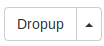
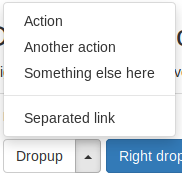

# Copy Puss-in-Boots

### Introduction

Remember when we [copied some basic CSS elements](https://github.com/abbreviatedman/copy-kitten) to get started learning CSS? We're going to start our Bootstrap journey by implementing some more advanced components.

### Your Task

You'll be creating three components: a drop-up menu, a progress bar, and an alert ribbon.

In this repo, you will find empty `index.html` and `style.css` files, as well as pictures of our target components in their various states. Use just the one index.html file (so you can easily launch live server) and make three components that look (and work!) as much as possible like our screengrabs. Make the components _in the order listed below_.

### Guidelines

##### Alert Ribbon

* This is what it should look like: 
* When the X on the right is hovered, the whole ribbon should disappear.
* It should NOT make the items below it move up when it does so.

##### Progress Bar

* This is what it should look like: 
* The progress bar (the blue part) should begin taking up 20% of the meter.
* When the _meter_ is hovered, the progress bar should grow to 80%.
* When the meter is unhovered, the progress bar should shrink back to 20%.
* The meter should fill and unfill smoothly, not abruptly.

##### Drop-Up Menu

* Please ignore everything outside the "Dropup" button and the menu above it with its four items ("Action", "Another action", ...). You do not need to make the "Right Drop" button.
* The button should be the only thing visible at first. The triangle section of the button should have the same background color at first as well. Like so: 
* On hovering the "Dropup" button's triangle, the menu with the four items should appear and the triangle should have the grey background you see. Like so: 
* Not pictured: on hovering over any of the menu items, they should have the same background as the hovered triangle.

### Stretch Goals

* DO make the items below the ribbon move up when it disappears. (If you did it that way initially, follow the original specification now instead.)
* Make all three work on click instead of hover. It will take some real hackery to make this work without JavaScript. (You should make this work without JavaScript.)